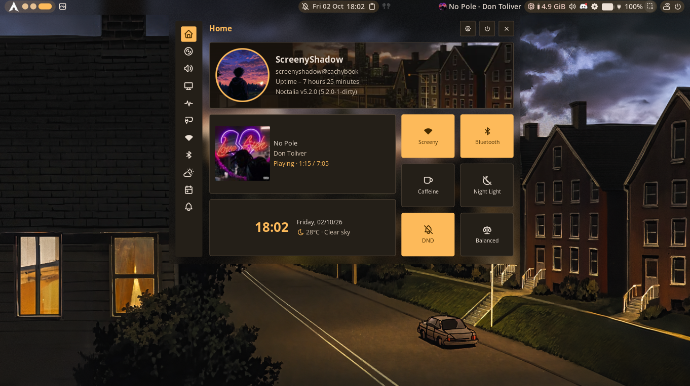
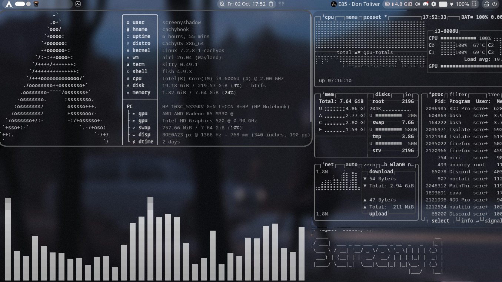
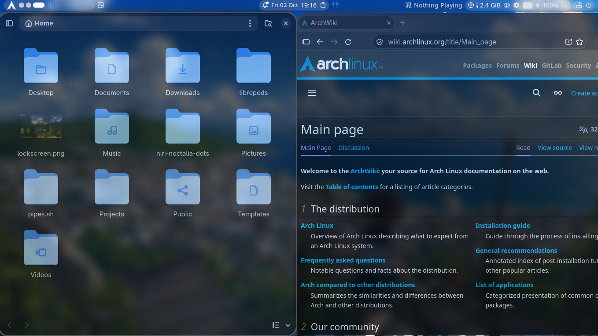
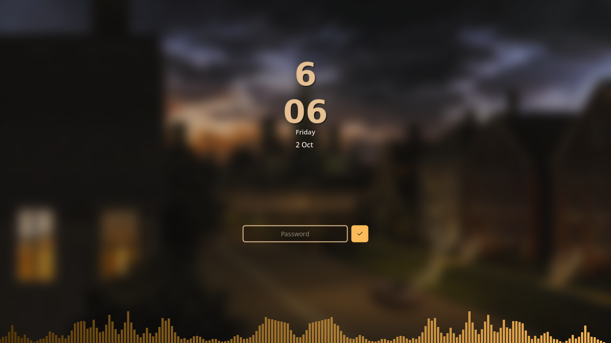
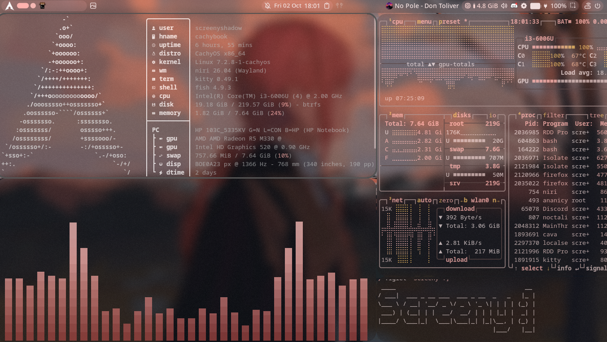

<div align="center">

# ✨ CachyOS · niri · Noctalia

**My blurry, translucent, wallpaper-themed Wayland setup**




</div>

---

## Gallery

| Terminal + fastfetch | Firefox + Nautilus | Lock screen |
|---|---|---|
|  |  |  |

---

## What I'm running

| Component | Choice |
|---|---|
| **Distro** | CachyOS |
| **Compositor** | [niri](https://github.com/niri-wm/niri) 26.04 |
| **Shell / bar** | [Noctalia](https://github.com/noctalia-dev/noctalia-shell) |
| **Terminal** | kitty |
| **Shell** | fish |
| **Browser** | Firefox |
| **File manager** | Nautilus |
| **System info** | fastfetch |

I use this on an old HP laptop with an i3-6006U and 8 GB of RAM, so it runs fine on weak hardware too.

---

## Blur and transparency

niri 26.04 added native background blur, so you don't need any forks or patches. All of my blur settings are in [`niri/.config/niri/rules.kdl`](niri/.config/niri/rules.kdl). Here are the main parts:

```kdl
blur {
    passes 6
    offset 4.0
    noise 0.03
    saturation 1.2
}

window-rule {
    geometry-corner-radius 20
    clip-to-geometry true
    draw-border-with-background false
}

window-rule {
    opacity 0.9
    background-effect {
        blur true
        xray true
    }
}
```

### If it doesn't look right

- **Focused window looks solid?** Add `draw-border-with-background false` to your global rule. Without it, the focus ring gets drawn behind the window and hides the blur.
- **Firefox is still opaque?** Set `widget.wayland.opaque-region.enabled` to `false` in `about:config` and restart Firefox completely.
- **A rule isn't applying?** Run `niri msg windows` and check the real app-id of the app. If it doesn't match your rule, nothing happens.
- **Can't see any blur?** Blur only shows on translucent windows, and a dark or plain wallpaper hides it. Try an opacity between 0.75 and 0.9 with a colorful wallpaper.
- **Want real blur of windows behind?** Change `xray true` to `false`. It looks better, but it uses more GPU.
- Later rules override earlier ones, so put exceptions like `mpv` at the bottom.
- Stuck or want a different look? You can paste your config into an AI like Claude or ChatGPT and ask it to tweak the blur, opacity or colors for you. That's a big part of how I got mine looking the way it does.

---

## Installation Process

> These are my personal configs. Back up your own first and read the files before copying anything.

**1. Install the packages**

```bash
sudo pacman -S niri kitty fish firefox nautilus fastfetch git
```

Noctalia isn't in this list, so install it by following the guide in its [repo](https://github.com/noctalia-dev/noctalia-shell).

**2. Clone the repo**

```bash
git clone https://github.com/Adarsh496/niri-noctalia-dots.git ~/niri-noctalia-dots
cd ~/niri-noctalia-dots
```

**3. Back up your current configs**

```bash
mkdir -p ~/config-backup
cp -r ~/.config/niri ~/.config/kitty ~/config-backup/ 2>/dev/null
```

**4. Copy the configs**

```bash
cp -r niri/.config/niri ~/.config/
cp -r kitty/.config/kitty ~/.config/
cp -r fish/.config/fish ~/.config/
cp -r fastfetch/.config/fastfetch ~/.config/
cp -r noctalia/.config/noctalia ~/.config/
```

**5. Check the config and reload**

```bash
niri validate
```

Then log out and back in, or let niri reload the config on its own.

---

## Repo structure

```
niri-noctalia-dots/
├── niri/          # config.kdl and rules.kdl (blur, opacity, window rules)
├── kitty/         # terminal config
├── fish/          # shell config
├── fastfetch/     # system info layout
├── noctalia/      # shell settings
├── wallpapers/    # backgrounds I use
└── screenshots/   # previews for this README
```

---

## Keybinds

| Keys | Action |
|---|---|
| `Mod + Enter` | Open terminal |
| `Mod + Q` | Close window |
| `Mod + O` | Overview |
| `Mod + Ctrl + Q` | Lock screen |

---

## Wallpapers

My wallpapers are in [`wallpapers/`](wallpapers/). Noctalia builds its color scheme from whatever wallpaper you pick, so changing it changes the colors of the bar, panels and apps too.



---

## Credits

- [niri](https://github.com/niri-wm/niri) by YaLTeR and contributors
- [Noctalia](https://github.com/noctalia-dev/noctalia-shell)
- The r/unixporn and r/niri communities for the inspiration

---

<div align="center">

If you like this setup, leave a star ⭐ ...

</div>
